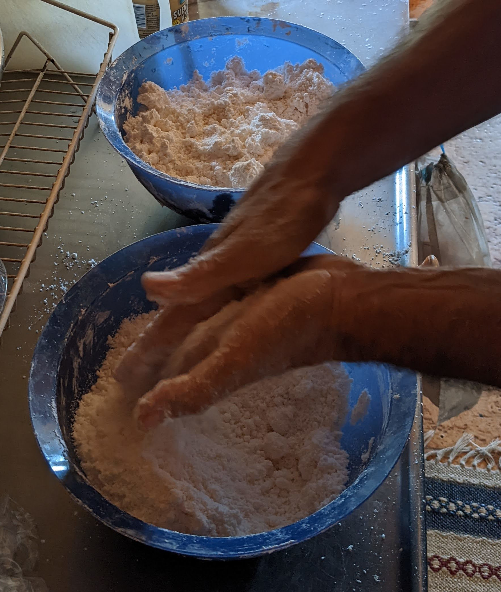

# Pão de Queijo

Receptet med något höftade mått räcker till tre plåtar Pão de Queijo. Supergott och glutenfritt.

## Ingredienser

- 1050 g Tapioca-mjöl (i vårt fall tre påsar Tapioca á 350 g).
- 6 dl mjölk, varav ca 5.5 dl till vätskan, resten till när ost masseras in i degen.
- 1 msk salt
- 50 g smör till vätskan och sen lite till till smeten.
- 6 ägg
- 700 g riven ost

## Degen, steg 1

Värm mjölk, salt och smör i en kastrull, låt det börja koka och till slut skumma.

Med tapiocan i en stor bunke, blanda successivt ner vätskan under omrörning, låt det ta tid och använd lite vätska i taget.

  

Det blir till en klumpig deg.

  

När vätskan blandats i, eller successivt då och då: Smula degen mellan händerna till små klumpar.

  

Degen ser ut som parmesan i konsistensen när den är klar.

  

Därefter låter man degen svalna, eftersom man sen blandar i ägg måste degen vara kall.

## Degen, steg 2

Massera ner sex ägg i degen, ett i taget. Degen ska inte bli seg och typ tråda sig när man drar isär den, det ska istället gå att ta upp en bit deg och sen typ knäcka den med ett jämnt snyggt snitt.
Denna processen tar en bra stund, till slut är degen gummiaktig. Var försiktig med äggen, man vill inte få i för mycket ägg.

Massera in 700 g riven ost i degen, vid behov också lite mjölk och smör. Målet är en jämn deg som det är lätt att forma små bullar av.

När degen är klar kan den vila upp till ett halvt dygn om man vill men man kan också direkt börja rulla köttbullsformade bullar och lägga ut på en plåt.

  

## Grädda bullarna

En vanlig plåt har t.ex. plats för 5x5 eller 5x6 bullar med lite plats mellan varje.

Olja in undersidan av en kopp eller ett glas, platta till alla bullarna.

Grädda på hög värme, gärna med varmluftsfläkten. 225-275 grader. Målet är en frasig yta och en lite mjukare ostig insida. :)

  

